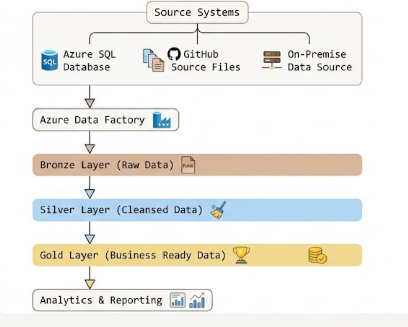

# Azure Data Factory End-to-End Data Engineering Project
## Project
Overview

This project demonstrates the design and implementation of a modern Azure Data Factory (ADF) data pipeline. The solution ingests data from multiple sources, stores raw data in Azure Data Lake Storage, applies transformations through data flows, and builds curated analytical datasets using a Bronze, Silver, and Gold architecture.

Project Objectives
Build an end-to-end Azure Data Engineering solution.
Implement automated ingestion pipelines using Azure Data Factory.
Load data incrementally using a watermark pattern.
Store raw and processed data in Azure Data Lake Storage Gen2.
Apply transformations using Mapping Data Flows.
Organise data using Bronze, Silver, and Gold layers.
Create reusable and scalable data pipelines.

## Architecture Diagram
 

## Technologies Used
Azure Data Factory
Azure SQL Database
Azure Data Lake Storage Gen2
Mapping Data Flows
Self-hosted Integration Runtime
GitHub Integration
Parquet Format
JSON Configuration Files
SQL

## Repository Structure

## Incremental Loading Pattern

### The Azure SQL ingestion pipeline uses a watermark-based incremental loading approach.

Process Flow
Lookup previous watermark value.
Retrieve latest available date from source.
Load only new records.
Update watermark after successful execution.
### Incremental Query Logic

